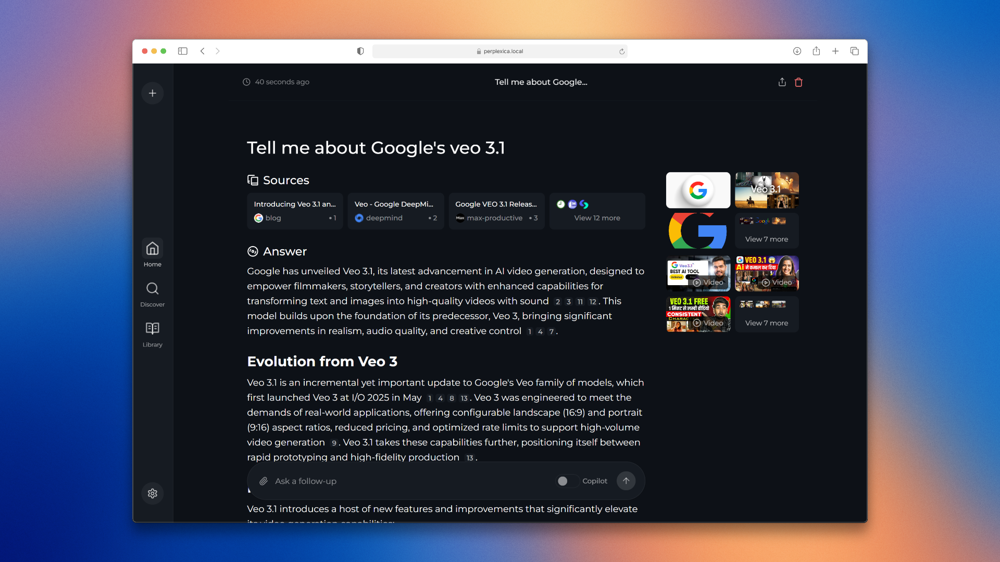

# Pro Comet 🚀

A **mobile-first AI search engine** with a beautiful liquid design inspired by Apple's aesthetics. Built for fun and optimized for the web, featuring glassmorphism UI, integrated browser, and intelligent search capabilities.



**Note**: This is a personal project by [Suhaib](https://github.com/Suhaib3100) - not intended for open-source distribution. Made for learning and experimentation with modern web technologies and AI integration.

## ✨ What's Inside

🎨 **Apple Liquid Design** - Pure black dark theme with glassmorphism effects, smooth animations, and gradient accents inspired by Apple's design language.

📱 **Mobile-First UX** - Optimized for touch interactions with bottom navigation, swipe gestures, and mobile app-style onboarding flow.

🌐 **Integrated Browser** - Quick-switch between search and web browsing with floating action buttons and seamless transitions.

🤖 **Multiple AI Providers** - Support for OpenAI, Anthropic Claude, Google Gemini, Groq, and local LLMs through Ollama.

🔍 **Smart Search Modes** - Balanced, Fast, and specialized focus modes for Academic, YouTube, Reddit, and more.

📷 **Rich Media Search** - Find images, videos, and web content all in one place powered by SearxNG.

📄 **File Upload Support** - Ask questions about your documents, PDFs, and images.

✨ **Welcome & Onboarding** - Beautiful 4-slide carousel with authentication flow for first-time users.

⚙️ **Account Management** - Profile settings, logout, and replay onboarding anytime from settings.

🎯 **Custom Features** - Weather widgets, news cards, citation sources, and thinking process visualization.

## 🚀 Quick Start

### Running with Docker (Recommended)

The easiest way to run Pro Comet locally:

```bash
docker run -d -p 3000:3000 -v perplexica-data:/home/perplexica/data -v perplexica-uploads:/home/perplexica/uploads --name pro-comet perplexica:latest
```

This starts Pro Comet with the bundled SearxNG search engine. Open http://localhost:3000 and complete the onboarding flow to get started.

### Building from Source

1. Clone this repository:
   ```bash
   git clone https://github.com/Suhaib3100/pro-comet.git
   cd pro-comet
   ```

2. Build and run:
   ```bash
   docker build -t perplexica .
   docker run -d -p 3000:3000 -v perplexica-data:/home/perplexica/data -v perplexica-uploads:/home/perplexica/uploads --name pro-comet perplexica
   ```

3. Access at http://localhost:3000 and complete the mobile-style onboarding flow.

### Development Setup (Without Docker)

1. Install SearXNG locally with JSON format and Wolfram Alpha enabled
2. Clone and install dependencies:
   ```bash
   git clone https://github.com/Suhaib3100/pro-comet.git
   cd pro-comet
   npm install
   ```

3. Build and start:
   ```bash
   npm run build
   npm run start
   ```

4. Open http://localhost:3000 and configure your AI providers in settings.

## 🎨 Tech Stack

- **Next.js 15.2.2** - React framework with App Router
- **TypeScript** - Type-safe development
- **Tailwind CSS** - Custom glassmorphism utilities
- **Framer Motion** - Smooth animations
- **Zustand** - State management
- **SearxNG** - Privacy-focused search aggregation
- **Docker** - Containerized deployment

## 📱 Mobile Features

The app is specifically optimized for mobile web browsers:

- **Bottom Navigation** - Thumb-friendly navigation with glass effects
- **Swipe Gestures** - Natural mobile interactions
- **Onboarding Flow** - 4-slide welcome + auth screens
- **Touch Optimized** - Large tap targets, smooth transitions
- **Responsive Design** - Works beautifully on all screen sizes
- **Browser Toggle** - Quick switch between chat and web view

## 🛠️ Configuration

After first launch, configure via Settings:

- **AI Providers**: Add API keys for OpenAI, Claude, Gemini, Groq, or Ollama
- **Search Settings**: Customize SearxNG URL and search behavior
- **Account**: Manage profile, logout, or replay onboarding
- **Theme**: Already optimized with dark glassmorphism theme

## 🔧 Troubleshooting

### Ollama Connection Issues

If you see Ollama connection errors:

1. Check API URL in Settings → Models
2. Use correct URL for your OS:
   - **Windows/Mac**: `http://host.docker.internal:11434`
   - **Linux**: `http://<your_local_ip>:11434`
3. **Linux users**: Expose Ollama to network by adding `Environment="OLLAMA_HOST=0.0.0.0:11434"` to `/etc/systemd/system/ollama.service`, then:
   ```bash
   systemctl daemon-reload
   systemctl restart ollama
   ```

### SearxNG Not Working

Ensure your SearxNG instance:
- Has JSON format enabled
- Has Wolfram Alpha engine enabled
- Is accessible at the configured URL (default: `http://localhost:8080`)

## 🎯 Future Ideas

Potential features to explore:

- 🎤 Voice search and voice responses
- 📖 AI reading mode with article extraction
- 📚 Smart bookmark collections
- 🔒 Privacy dashboard with tracker blocking
- 🌐 Offline mode with cached responses
- 📸 Image upload for visual search
- 🎨 Theme customization builder

## 📝 About

**Pro Comet** is a personal learning project exploring:
- Modern web design (glassmorphism, liquid aesthetics)
- Mobile-first development
- AI integration and LLM orchestration
- Docker containerization
- TypeScript and Next.js 15

Built by [Suhaib](https://github.com/Suhaib3100) for fun and experimentation. Not intended as an open-source project or for public distribution.

**Based on**: Originally forked from [Perplexica](https://github.com/ItzCrazyKns/Perplexica) by ItzCrazyKns, but heavily modified with custom UI/UX focused on mobile web experience.

## ⚖️ License

This is a personal project. The original Perplexica project is MIT licensed. This fork contains significant custom modifications and is maintained separately for learning purposes.

---

**Note**: This project is actively being experimented with. Expect frequent changes, bugs, and unfinished features. Use at your own risk! 🚀
